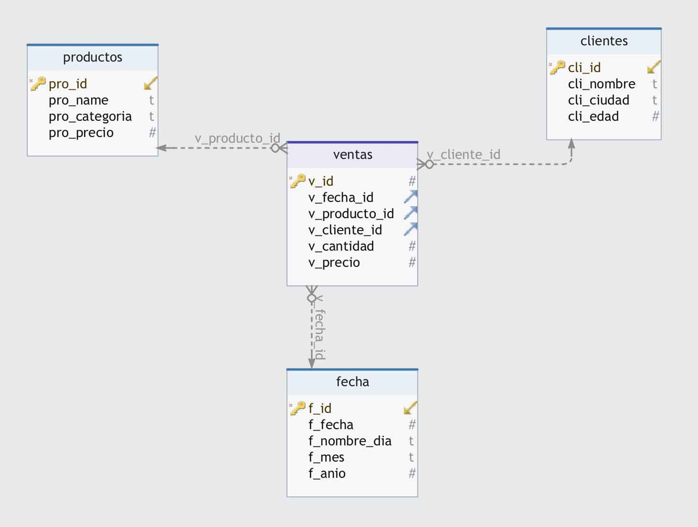

# modelo-estrella-sql
Código de ejemplo para la entrada de mi blog sobre el modelo de estrella: https://www.0xtrivi.com/esquema-de-estrella/

Este código crea cuatro tablas. Una tabla de hechos llamada Ventas asociada a tres tablas de dimensiones: Productos, Clientes y Fechas.
Posteriormente se realizan unas inserciones de registros.
